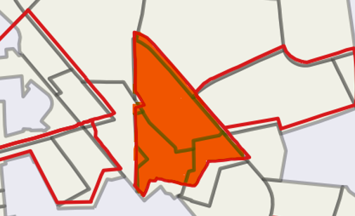

# Reproyeccion_AGEBS

Las AGEBS (Áreas Geoestadísticas Básicas) de 1990 presentan un desafío significativo debido a un desalineamiento espacial cuando se comparan con los datos actuales. En las últimas tres décadas, las áreas urbanas han experimentado un crecimiento y transformación extensos, lo que ha provocado cambios en los límites y características de estas unidades. Los polígonos de 1990 ya no reflejan con precisión el paisaje urbano actual, lo que puede dificultar la planificación y el análisis efectivos.

Para abordar este problema, el objetivo es ajustar los polígonos de 1990 para alinearlos con los polígonos de 2020. Este ajuste garantiza que los datos históricos sigan siendo relevantes y útiles para aplicaciones contemporáneas, permitiendo un análisis más preciso del desarrollo urbano y los cambios a lo largo del tiempo.

{width="316"}

Todo este proceso está explicado en el siguiente blog: https://www.manuelsolan-o.com/blogs/agebs_repro_en/
